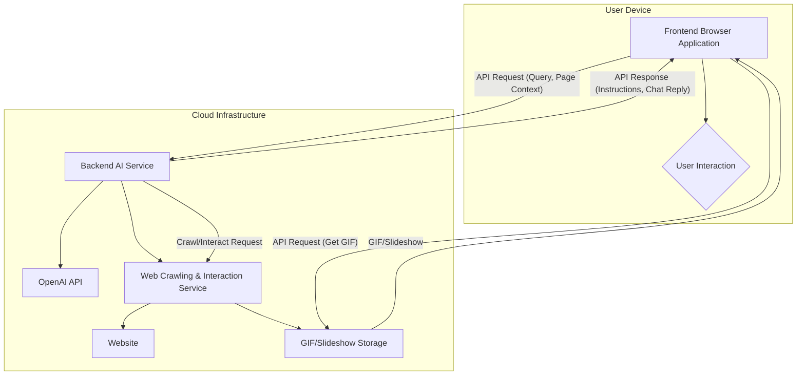

# Product Requirements Document: AI-Powered Lightweight Browser

## 1. Introduction

### 1.1 Product Vision

The vision for this AI-powered lightweight browser is to democratize access to the complex digital world, making the internet intuitively navigable and empowering for everyone, especially non-technical users. We envision a browsing experience where users are guided seamlessly through their online goals, free from the intimidation of complicated interfaces and overwhelming information. This browser will serve as an intelligent companion, transforming the web from a labyrinth of links and forms into a clear, guided pathway to desired outcomes.

### 1.2 Mission Statement

Our mission is to create a lightweight, secure, and intelligent browser that simplifies web interaction through AI-driven guidance and predictive visual feedback. By leveraging advanced web automation and natural language processing, we aim to provide a user-friendly platform that anticipates user needs, clarifies complex workflows, and enhances digital literacy for the general public, ultimately fostering a more accessible and efficient online experience for all.

### 1.3 Target Audience

The primary target audience for this browser is the **general public and non-tech-savvy users** who frequently encounter difficulties navigating complex websites or completing online tasks. This includes, but is not limited to:

*   **Elderly users:** Who may find modern web interfaces confusing or overwhelming.
*   **Individuals with limited digital literacy:** Who struggle with online forms, e-commerce, or service portals.
*   **Users seeking simplicity:** Those who prefer a minimalist browsing experience free from distractions and resource-heavy features.
*   **Anyone frustrated by complex web pages:** Users who wish for a more guided and less intimidating way to interact with the internet.

This browser is designed for individuals who value ease of use, clear instructions, and a supportive digital environment over advanced customization or a multitude of complex features. It aims to reduce cognitive load and increase confidence in online interactions.

## 2. Core Features

This section outlines the essential features that define the AI-powered lightweight browser, focusing on how each addresses the needs of our target audience and contributes to the overall product vision.

### 2.1 Lightweight Design and Performance

**Description:** The browser will be engineered from the ground up to be exceptionally lightweight, consuming minimal system resources (CPU, RAM, and battery). This design philosophy prioritizes speed, responsiveness, and efficiency, ensuring a smooth browsing experience even on older or less powerful devices. Unlike feature-heavy mainstream browsers, our browser will focus on core functionalities augmented by intelligent AI, rather than an extensive array of built-in tools that may contribute to bloat.

**Justification:** A lightweight design directly addresses a significant pain point for non-tech-savvy users and those with older hardware: slow performance and resource drain. By minimizing resource consumption, the browser will offer a consistently fast and fluid experience, reducing frustration and making the web more accessible. This aligns with the simplicity and ease-of-use principles crucial for our target audience, ensuring that the browser itself does not become a barrier to digital interaction.

**Technical Considerations:** The choice of Playwright as the underlying web crawling and automation engine supports this lightweight approach by providing efficient, programmatic control over browser instances without the overhead of a full, user-facing browser application. The frontend will be built with a minimalist framework, optimizing for fast load times and low memory footprint.

### 2.2 Dark and Light Mode

**Description:** The browser will offer both a dark mode and a light mode, allowing users to switch between themes based on their preference, ambient lighting conditions, or accessibility needs. The design will adhere to a clean, modern, and minimalistic aesthetic, utilizing a color palette that is easy on the eyes and promotes readability in both modes. For dark mode, a combination of white and dark grey will be used, specifically avoiding blue tints to ensure visual comfort and a sophisticated appearance.

**Justification:** Providing dark and light modes enhances user comfort and accessibility. Dark mode can reduce eye strain in low-light environments and conserve battery life on certain screens, while light mode offers optimal readability in bright conditions. This feature caters to personal preferences and diverse visual needs, contributing to a more inclusive and user-friendly experience for the general public. The specific instruction to avoid blue tints in dark mode is based on best practices for visual comfort and modern UI design.

**Technical Considerations:** Implementation will involve CSS variables or similar theming mechanisms to allow for easy toggling between modes without requiring page reloads. The UI components will be designed with both themes in mind from the outset to ensure a consistent and polished look.

### 2.3 Fresh Crawl Button

**Description:** A prominent and easily accessible 

button, clearly labeled as "Fresh Crawl" or similar, will be available within the browser interface. This button will trigger an immediate re-crawling of the currently viewed webpage using Playwright, ensuring that the AI's understanding and any generated instructions or visual aids are based on the most up-to-date content. This is distinct from a standard browser refresh, as it specifically instructs the underlying AI system to re-process the page.

**Justification:** For non-tech-savvy users, the concept of cached content or dynamic page updates can be confusing. A dedicated "Fresh Crawl" button provides a simple, explicit mechanism for users to ensure they are interacting with the latest version of a webpage. This empowers users by giving them direct control over the AI's data source, fostering trust and transparency. It addresses scenarios where website content changes frequently or where a user suspects the AI's guidance might be based on outdated information, providing a quick and easy way to synchronize.

**Technical Considerations:** Clicking this button will initiate a Playwright-driven crawl of the current URL. The browser's frontend will display a clear visual indicator (e.g., a loading spinner) while the crawl is in progress, and the AI backend will then re-process the newly acquired page data. This will involve a direct API call to the AI backend, instructing it to invalidate any cached data for the current URL and perform a new analysis.

### 2.4 Predictive Hover Interactions (GIFs/Slideshows)

**Description:** A groundbreaking feature of this browser will be its ability to provide predictive visual feedback for interactive elements. When a user mouses over any clickable button, link, or interactive component on a webpage, the browser will display a small, contextual GIF or short slideshow previewing the immediate outcome of clicking that element. This "what's next" visual will appear as a subtle overlay, demonstrating the typical interaction flow or the resulting page state without the user having to commit to the click.

**Justification:** This feature directly addresses a major source of anxiety and confusion for non-tech-savvy users: uncertainty about what will happen after clicking an unfamiliar button or link. By visually demonstrating the outcome, the browser reduces cognitive load, prevents accidental navigation to unwanted pages, and builds user confidence. It transforms abstract actions into concrete, understandable visual sequences, making complex web forms, navigation menus, and interactive applications far more approachable. This is particularly valuable on complicated web pages where the function of buttons may not be immediately obvious or where multiple steps are involved in a workflow.

**Technical Considerations:** This feature will require a sophisticated backend system that uses Playwright to simulate interactions on web pages. When a page is crawled, the AI system will identify interactive elements. For each identified element, Playwright will programmatically interact with it (e.g., click it) and record a short video or capture a sequence of screenshots of the resulting changes. These recordings will then be converted into optimized GIFs or slideshows and stored. The frontend browser will dynamically fetch and display these pre-generated visuals when a user hovers over the corresponding element. Caching mechanisms will be crucial to ensure fast retrieval and display of these visual previews. The AI will also need to intelligently determine the most relevant outcome to preview, especially for elements with multiple potential actions.

### 2.5 Native Intelligence with OpenAI for Smart Chat and Workflow Guidance

**Description:** The browser will integrate native intelligence, powered by OpenAI's advanced language models, to provide users with smart chat capabilities and proactive guidance based on their stated goals or natural common workflows. Users will be able to interact with an AI assistant directly within the browser, asking questions about the current webpage, seeking instructions on how to achieve a specific task (e.g., "How do I buy this product?" or "Where do I find my account settings?"), or requesting explanations of complex content. The AI will leverage its understanding of the webpage's structure, content, and the user's implicit intent to provide clear, step-by-step instructions, highlight relevant elements, and offer contextual advice.

**Justification:** This feature is the cornerstone of the browser's AI-powered assistance, directly addressing the need for intelligent guidance for non-tech-savvy users. Instead of passively browsing, users can actively engage with the browser to achieve their objectives. The smart chat transforms the browser into a personal tutor for the internet, breaking down complicated processes into manageable steps and offering explanations in plain language. This significantly reduces the barrier to entry for complex online tasks and empowers users to confidently navigate the web, fostering digital independence. The integration with OpenAI ensures state-of-the-art natural language understanding and generation capabilities.

**Technical Considerations:** This will involve a backend service that acts as an intermediary between the browser frontend and the OpenAI API. The service will receive user queries, combine them with the current webpage's content (obtained via Playwright crawling), and potentially the user's browsing history (with explicit user consent and privacy safeguards), to formulate prompts for the OpenAI model. The OpenAI model's responses will then be parsed and presented to the user in a clear, actionable format within the browser's chat interface. This may include highlighting elements on the page, suggesting next steps, or providing direct answers. Robust error handling, rate limiting for API calls, and privacy-preserving data handling will be critical. The AI will need to be fine-tuned or prompted effectively to provide instructions tailored to the non-technical user, avoiding jargon and focusing on clarity.

### 2.6 Non-Functional Requirements

Non-functional requirements specify criteria that can be used to judge the operation of a system, rather than specific behaviors. These are crucial for the overall quality and success of the AI-powered browser.

#### 2.6.1 Performance

*   **Responsiveness:** The browser UI must be highly responsive, with page loads and AI interactions occurring within acceptable timeframes (e.g., page load times under 3 seconds on average, AI chat responses within 5 seconds).
*   **Resource Usage:** The browser must maintain low CPU and RAM consumption, especially when idle or with multiple tabs open, to uphold its lightweight promise. Target memory usage should be significantly lower than mainstream browsers.
*   **Scalability:** The AI backend infrastructure must be scalable to handle a growing number of users and concurrent requests for crawling and AI processing.

#### 2.6.2 Security

*   **Data Privacy:** User data, especially browsing history and AI chat interactions, must be handled with the utmost privacy. All data transmission will be encrypted (HTTPS/WSS).
*   **Secure Storage:** Any locally stored user data (e.g., settings, preferences) must be securely encrypted.
*   **Protection against Malicious Content:** The browser will incorporate standard security features to protect users from phishing, malware, and other web-based threats.
*   **Playwright Isolation:** Playwright instances used for crawling will operate in isolated environments to prevent any potential security vulnerabilities from affecting the user's main browsing session.

#### 2.6.3 Accessibility

*   **WCAG Compliance:** The browser UI will aim for WCAG 2.1 AA compliance to ensure usability for individuals with disabilities.
*   **Keyboard Navigation:** All interactive elements must be navigable and operable via keyboard.
*   **Screen Reader Compatibility:** The UI elements and content must be properly structured and labeled for screen reader accessibility.
*   **Customizable Text Size:** Users must be able to adjust text size without breaking the layout.

#### 2.6.4 Reliability

*   **Stability:** The browser must be stable and minimize crashes or freezes, providing a consistent user experience.
*   **Error Handling:** Clear and user-friendly error messages will be provided for any issues encountered during browsing or AI interactions.
*   **Offline Capability (Limited):** Basic browser functionality (e.g., viewing cached pages) should be available offline where technically feasible.

#### 2.6.5 Usability

*   **Intuitive Interface:** The UI must be extremely intuitive and easy to understand for non-tech-savvy users, requiring minimal learning.
*   **Clear Feedback:** Users must receive clear and immediate feedback for all actions and system states.
*   **Consistency:** The design and interaction patterns will be consistent throughout the application.

#### 2.6.6 Maintainability

*   **Modular Architecture:** The codebase will be modular and well-documented to facilitate future development and maintenance.
*   **Updatability:** The browser must support seamless updates to introduce new features and security patches.

#### 2.6.7 Compatibility

*   **Operating Systems:** The browser will be compatible with major operating systems (e.g., Windows, macOS, Linux, Android, iOS) as a cross-platform application.
*   **Web Standards:** The browser will adhere to modern web standards to ensure proper rendering of websites.
*   **Device Responsiveness:** The UI will be fully responsive and optimized for various screen sizes and device types (desktop, tablet, mobile).

## 3. Technical Architecture and Specifications

This section provides a high-level overview of the technical architecture, technology stack, and data flow for the AI-powered lightweight browser. The architecture is designed to be modular, scalable, and secure, supporting the core features outlined in the previous section.

### 3.1 High-Level Architecture

The system is composed of three main components: the **Frontend Browser Application**, the **Backend AI Service**, and the **Web Crawling & Interaction Service**. These components work together to deliver the intelligent and guided browsing experience.

**1. Frontend Browser Application:**
*   **Description:** This is the user-facing application, a lightweight browser built on a modern cross-platform framework. It provides the user interface, manages user interactions, and communicates with the backend services.
*   **Responsibilities:**
    *   Rendering web pages.
    *   Handling user input (navigation, clicks, text entry).
    *   Displaying the AI chat interface.
    *   Requesting and displaying predictive hover GIFs/slideshows.
    *   Managing user settings (e.g., dark/light mode).
    *   Communicating with the Backend AI Service via a secure API.

**2. Backend AI Service:**
*   **Description:** This service is the brain of the browser, responsible for processing user queries, interacting with the OpenAI API, and orchestrating the web crawling and interaction service.
*   **Responsibilities:**
    *   Receiving user queries and page context from the frontend.
    *   Formulating prompts for the OpenAI API.
    *   Processing responses from OpenAI to generate clear instructions and chat replies.
    *   Managing user sessions and context.
    *   Triggering the Web Crawling & Interaction Service to analyze pages or generate visual previews.
    *   Serving as the central hub for AI-related logic.

**3. Web Crawling & Interaction Service:**
*   **Description:** This is a dedicated service that uses Playwright to programmatically interact with web pages in a headless environment. It is responsible for crawling websites, simulating user actions, and generating the visual previews for the predictive hover feature.
*   **Responsibilities:**
    *   Crawling web pages to extract their structure, content, and interactive elements.
    *   Simulating clicks and other interactions on identified elements.
    *   Recording the outcomes of these interactions as videos or screenshot sequences.
    *   Converting recordings into optimized GIFs or slideshows.
    *   Storing and serving these visual previews.
    *   Operating in a secure, isolated environment to prevent any impact on the user's main browsing session.

**Architectural Diagram:**

### 3.2 Technology Stack

The technology stack is chosen to support the requirements of a lightweight, cross-platform, and intelligent browser. The stack is divided into frontend, backend, and infrastructure components.

*   **Frontend Browser Application:**
    *   **Framework:** A modern, cross-platform framework like **Electron** or **Tauri** will be used to build the desktop browser application. For mobile, a framework like **React Native** or **Flutter** will be considered to ensure a consistent experience across all devices.
    *   **UI Library:** A lightweight UI library such as **React** or **Vue.js** will be used to build the user interface, ensuring a responsive and modern design.
    *   **State Management:** A state management library (e.g., Redux, MobX) will be used to manage the application state efficiently.

*   **Backend AI Service:**
    *   **Language/Framework:** **Node.js** with a framework like **Express.js** or **Fastify** is a strong candidate due to its non-blocking I/O and large ecosystem, making it suitable for handling API requests and orchestrating services. **Python** with **Flask** or **FastAPI** is also a viable alternative, especially given its strong AI/ML ecosystem.
    *   **Database:** A NoSQL database like **MongoDB** or a relational database like **PostgreSQL** will be used for storing user data (with consent), session information, and cached AI responses.

*   **Web Crawling & Interaction Service:**
    *   **Core Library:** **Playwright** will be the core library for browser automation, web crawling, and interaction simulation.
    *   **Language:** This service will likely be implemented in **Node.js** or **Python** to align with the backend service and leverage the respective Playwright SDKs.
    *   **Media Processing:** Libraries like **FFmpeg** will be used for converting video recordings into GIFs.

*   **AI and Machine Learning:**
    *   **LLM Provider:** **OpenAI API** (specifically, models like GPT-4 or its successors) will be used for natural language understanding and generation.

*   **Infrastructure and Deployment:**
    *   **Cloud Provider:** A major cloud provider like **Amazon Web Services (AWS)**, **Google Cloud Platform (GCP)**, or **Microsoft Azure** will be used to host the backend services and infrastructure.
    *   **Containerization:** **Docker** will be used to containerize the backend services for consistent deployment and scalability.
    *   **Orchestration:** **Kubernetes** will be used to orchestrate and manage the containerized services, ensuring high availability and scalability.
    *   **Storage:** A cloud storage solution like **Amazon S3** or **Google Cloud Storage** will be used to store the generated GIFs and slideshows.

### 3.3 Data Flow

This section describes the flow of data through the system for key user interactions.

**1. User Asks for Guidance:**
1.  The user types a query into the AI chat interface in the **Frontend Browser Application** (e.g., "How do I check out?").
2.  The frontend sends a secure API request to the **Backend AI Service**, including the user's query, the current URL, and a sanitized representation of the webpage's content/structure.
3.  The backend service validates the request and constructs a detailed prompt for the **OpenAI API**, combining the user's query with the contextual information about the webpage.
4.  The OpenAI API processes the prompt and returns a natural language response.
5.  The backend service receives the response, parses it to extract actionable instructions, and may format it for clarity.
6.  The backend service sends the formatted instructions back to the frontend.
7.  The frontend displays the instructions in the chat interface and may highlight the relevant elements on the webpage as indicated by the backend.

**2. User Hovers Over a Button (Predictive Hover):**
1.  The user moves their mouse cursor over an interactive element (e.g., a "Continue" button) on a webpage in the **Frontend Browser Application**.
2.  The frontend identifies the element and sends a request to a media storage service (e.g., Amazon S3) to fetch the pre-generated GIF/slideshow associated with that element's unique identifier.
3.  The storage service returns the visual preview.
4.  The frontend displays the GIF/slideshow in a non-intrusive overlay near the user's cursor.

**3. Generation of Predictive Hover Visuals (Background Process):**
1.  When a user visits a new or updated webpage, the **Frontend Browser Application** notifies the **Backend AI Service**.
2.  The backend service queues a task for the **Web Crawling & Interaction Service** to analyze the page.
3.  The crawling service launches a headless Playwright instance, navigates to the URL, and identifies all interactive elements.
4.  For each interactive element, the service simulates a click and records a short video of the resulting page transition or change.
5.  The recorded video is processed (e.g., using FFmpeg) to create an optimized GIF or a series of screenshots for a slideshow.
6.  The generated visual preview is uploaded to the **GIF/Slideshow Storage** (e.g., Amazon S3) with a unique identifier linked to the specific webpage element.
7.  This process happens asynchronously in the background to avoid impacting the user's browsing experience.

## 4. User Experience and Interface Requirements

This section outlines the user experience design principles, user personas, use cases, and interface requirements that will guide the development of the AI-powered lightweight browser. The focus is on creating an intuitive, accessible, and empowering experience for non-tech-savvy users.

### 4.1 User Personas and Use Cases

Understanding the target users is crucial for designing an effective and user-friendly browser. The following personas represent the primary user groups for this AI-powered browser.

**Persona 1: Margaret, 68, Retired Teacher**

*Background:* Margaret is a retired elementary school teacher who enjoys staying connected with family and friends online. She uses the internet for email, social media, online shopping, and reading news. However, she often finds modern websites confusing and overwhelming, especially when trying to complete tasks like booking travel or managing her online banking.

*Goals:*
*   Complete online tasks confidently without feeling overwhelmed.
*   Understand what will happen before clicking on buttons or links.
*   Get clear, step-by-step instructions for complex processes.
*   Have a fast, reliable browsing experience that doesn't slow down her older laptop.

*Pain Points:*
*   Complicated website layouts with too many options.
*   Uncertainty about what clicking a button will do.
*   Technical jargon and unclear instructions.
*   Slow browsers that frustrate her and waste her time.

*Use Cases:*
*   **Online Shopping:** Margaret wants to buy a gift for her granddaughter. She needs guidance on how to navigate the e-commerce site, add items to her cart, and complete the checkout process safely.
*   **Banking:** She wants to check her account balance and transfer money to her savings account. The banking website has many buttons and options, and she needs clear instructions on which ones to click.
*   **Travel Booking:** Margaret wants to book a flight to visit her son. The airline website is complex, and she needs help understanding the different fare options and completing the booking process.

**Persona 2: Carlos, 45, Small Business Owner**

*Background:* Carlos owns a small auto repair shop and is not particularly tech-savvy. He uses the internet primarily for business purposes: ordering parts, managing his business's online presence, and handling administrative tasks. He values efficiency and simplicity, as he has limited time to spend learning new technologies.

*Goals:*
*   Quickly complete business-related online tasks.
*   Navigate supplier websites efficiently to order parts.
*   Manage his business's online listings and reviews.
*   Avoid making costly mistakes when placing orders or filling out forms.

*Pain Points:*
*   Complex supplier websites with confusing navigation.
*   Fear of making mistakes when placing large orders.
*   Time wasted trying to figure out how to complete tasks.
*   Websites that are slow or don't work well on his older computer.

*Use Cases:*
*   **Parts Ordering:** Carlos needs to order specific auto parts from a supplier's website. The site has a complex catalog, and he needs guidance on how to find the right parts and complete the order correctly.
*   **Business Management:** He wants to update his business information on Google My Business and respond to customer reviews. The interface is not intuitive, and he needs step-by-step instructions.
*   **Government Forms:** Carlos needs to file quarterly tax forms online. The government website is complex, and he needs clear guidance to avoid errors that could result in penalties.

**Persona 3: Aisha, 29, New Internet User**

*Background:* Aisha recently moved to a new country and is learning to use the internet for the first time. She is intelligent and eager to learn, but she lacks familiarity with common web conventions and terminology. She needs to use the internet for essential tasks like finding housing, applying for jobs, and accessing government services.

*Goals:*
*   Learn how to use the internet effectively for essential tasks.
*   Understand web conventions and terminology.
*   Complete important tasks like job applications and government forms.
*   Build confidence in her digital skills.

*Pain Points:*
*   Unfamiliarity with web conventions (e.g., what different types of links do).
*   Overwhelming amount of information and options on websites.
*   Fear of making mistakes that could have serious consequences.
*   Language barriers and complex terminology.

*Use Cases:*
*   **Job Applications:** Aisha needs to apply for jobs online. She needs guidance on how to navigate job boards, create profiles, and submit applications correctly.
*   **Government Services:** She needs to apply for various government services and benefits. The websites are complex, and she needs clear, step-by-step instructions.
*   **Housing Search:** Aisha is looking for an apartment. She needs help understanding how to use rental websites, contact landlords, and avoid scams.

### 4.2 User Journey Mapping

Understanding the user journey helps identify key touchpoints and opportunities for the AI browser to provide value. The following journey map illustrates a typical user experience when trying to complete an online task.

**User Journey: Online Shopping (Margaret's Perspective)**

1.  **Initial Goal:** Margaret wants to buy a birthday gift for her granddaughter.
2.  **Entry Point:** She opens the browser and navigates to an online store.
3.  **Challenge 1:** The homepage has many categories and promotional banners. Margaret is unsure where to start.
    *   **AI Browser Solution:** The AI chat proactively asks, "What are you looking for today?" and provides clear guidance based on her response.
4.  **Challenge 2:** She finds a product she likes but is unsure about the size and return policy.
    *   **AI Browser Solution:** When she hovers over the "Add to Cart" button, a GIF preview shows the next steps in the process, including size selection and return policy information.
5.  **Challenge 3:** The checkout process has multiple steps and asks for information she's not sure about.
    *   **AI Browser Solution:** The AI chat provides step-by-step instructions for each part of the checkout process, explaining what each field means and why it's needed.
6.  **Success:** Margaret successfully completes her purchase with confidence, feeling empowered rather than frustrated.

### 4.3 Interface Design Principles

The interface design will adhere to the following principles to ensure a user-friendly experience for non-tech-savvy users:

**1. Simplicity and Minimalism:**
The interface will embrace a clean, minimalistic design inspired by modern standards like OpenAI's interface design. The focus will be on essential elements, with a centered layout that draws attention to the primary actions. Unnecessary visual clutter will be eliminated to reduce cognitive load.

**2. Clear Visual Hierarchy:**
Important elements will be prominently displayed using size, color, and positioning to guide the user's attention. The most critical actions (e.g., the AI chat, navigation controls) will be easily identifiable and accessible.

**3. Consistent Design Language:**
All interface elements will follow a consistent design language, including typography, color schemes, iconography, and interaction patterns. This consistency helps users build familiarity and confidence as they use the browser.

**4. Accessibility-First Design:**
The interface will be designed with accessibility in mind from the outset, ensuring compatibility with screen readers, keyboard navigation, and other assistive technologies. High contrast ratios and scalable text will be standard features.

**5. Responsive and Touch-Friendly:**
The interface will be fully responsive, adapting seamlessly to different screen sizes and orientations. Touch targets will be appropriately sized for mobile devices, and interactions will be optimized for both mouse and touch input.

### 4.4 Key Interface Components

**1. Main Browser Window:**
*   **Address Bar:** A clean, prominent address bar at the top of the window, with integrated search functionality.
*   **Navigation Controls:** Simple back, forward, and refresh buttons, along with the distinctive "Fresh Crawl" button.
*   **Theme Toggle:** An easily accessible toggle for switching between dark and light modes.
*   **AI Chat Interface:** A collapsible chat panel that can be accessed via a prominent icon or button, allowing users to interact with the AI assistant.

**2. AI Chat Interface:**
*   **Design:** The chat interface will feature a centered text input box with a clean, modern design. The conversation history will be displayed above the input box in a clear, readable format.
*   **Input Methods:** Users can type their questions or use voice input (if supported) to interact with the AI.
*   **Response Format:** AI responses will be formatted for clarity, with step-by-step instructions highlighted and relevant webpage elements indicated.

**3. Predictive Hover Overlays:**
*   **Design:** When a user hovers over an interactive element, a small, non-intrusive overlay will appear near the cursor, displaying the GIF or slideshow preview.
*   **Positioning:** The overlay will be positioned to avoid blocking important content while remaining clearly visible.
*   **Animation:** Smooth fade-in and fade-out animations will be used to make the appearance and disappearance of overlays feel natural and polished.

**4. Settings and Preferences:**
*   **Accessibility:** A dedicated settings panel will allow users to customize accessibility options, such as text size, contrast, and keyboard navigation preferences.
*   **Privacy Controls:** Clear and simple privacy controls will allow users to manage their data and AI interaction preferences.
*   **Theme Customization:** Options for customizing the appearance, including the choice between dark and light modes.

### 4.5 Responsive Design Requirements

The browser must provide an excellent experience across all device types and screen sizes. The responsive design will ensure that the core functionality and user experience remain consistent whether the user is on a desktop computer, tablet, or smartphone.

**Desktop (1024px and above):**
*   Full-featured interface with all elements visible and easily accessible.
*   AI chat panel can be displayed as a sidebar or overlay.
*   Predictive hover overlays work seamlessly with mouse interactions.

**Tablet (768px to 1023px):**
*   Optimized layout that takes advantage of the larger screen while remaining touch-friendly.
*   AI chat interface adapts to touch interactions.
*   Predictive hover functionality adapts to touch gestures (e.g., long press).

**Mobile (767px and below):**
*   Streamlined interface optimized for small screens and touch interactions.
*   AI chat interface becomes the primary method for getting assistance.
*   Navigation and controls are optimized for thumb-friendly interaction.
*   Predictive interactions are adapted for touch (e.g., tap and hold for preview).

The responsive design will ensure that non-tech-savvy users can access the browser's intelligent features regardless of their device, promoting digital inclusion and accessibility across all platforms.

## 5. Development Roadmap and Success Metrics

This section outlines the development phases, milestones, timeline, and key performance indicators (KPIs) that will guide the successful creation and launch of the AI-powered lightweight browser. The roadmap is designed to deliver value incrementally while building toward the full vision of an intelligent, user-friendly browsing experience.

### 5.1 Development Phases and Milestones

The development of the AI-powered browser will be divided into four main phases, each with specific deliverables and milestones. This phased approach allows for iterative development, early user feedback, and risk mitigation.

**Phase 1: Foundation and Core Infrastructure (Months 1-4)**

*Objective:* Establish the foundational architecture and core infrastructure required to support the AI-powered browser.

*Key Deliverables:*
*   **Basic Browser Framework:** Develop a lightweight, cross-platform browser application with essential browsing capabilities (navigation, page rendering, basic UI).
*   **Backend AI Service:** Implement the backend service architecture with basic API endpoints for communication between the frontend and AI services.
*   **Playwright Integration:** Integrate Playwright for web crawling and basic page analysis capabilities.
*   **OpenAI API Integration:** Establish secure communication with the OpenAI API and implement basic chat functionality.
*   **Dark/Light Mode:** Implement the theme switching functionality with a clean, minimalistic design.

*Milestones:*
*   **Month 1:** Complete technical architecture design and development environment setup.
*   **Month 2:** Basic browser framework operational with navigation and page rendering.
*   **Month 3:** Backend AI service deployed with OpenAI integration and basic chat functionality.
*   **Month 4:** Playwright integration complete with basic web crawling capabilities.

*Success Criteria:*
*   Users can browse websites with basic functionality.
*   AI chat interface responds to simple queries about webpage content.
*   System architecture supports scalable development for subsequent phases.

**Phase 2: AI-Powered Guidance and Chat (Months 5-8)**

*Objective:* Implement the core AI-powered features that provide intelligent guidance and assistance to users.

*Key Deliverables:*
*   **Enhanced AI Chat:** Develop sophisticated AI chat capabilities that can provide step-by-step instructions for common web tasks.
*   **Contextual Understanding:** Implement advanced webpage analysis to provide contextually relevant guidance.
*   **Fresh Crawl Functionality:** Complete the "Fresh Crawl" button feature for real-time page re-analysis.
*   **User Goal Recognition:** Develop AI capabilities to understand and respond to user goals and common workflows.
*   **Security and Privacy Framework:** Implement robust security measures and privacy controls.

*Milestones:*
*   **Month 5:** Enhanced AI chat with contextual webpage understanding.
*   **Month 6:** Fresh Crawl functionality operational and integrated.
*   **Month 7:** User goal recognition and workflow guidance capabilities.
*   **Month 8:** Security and privacy framework implementation complete.

*Success Criteria:*
*   AI can provide accurate, step-by-step instructions for common web tasks.
*   Users can successfully complete complex workflows with AI guidance.
*   Security and privacy measures meet industry standards.

**Phase 3: Predictive Hover and Visual Previews (Months 9-12)**

*Objective:* Implement the innovative predictive hover feature that provides visual previews of user interactions.

*Key Deliverables:*
*   **Interactive Element Detection:** Develop advanced algorithms to identify and catalog interactive elements on web pages.
*   **Interaction Simulation:** Implement Playwright-based simulation of user interactions to generate visual previews.
*   **GIF/Slideshow Generation:** Create the media processing pipeline to convert interaction recordings into optimized visual previews.
*   **Preview Storage and Delivery:** Implement efficient storage and delivery systems for visual previews.
*   **Hover Interface Integration:** Integrate the predictive hover functionality into the browser's user interface.

*Milestones:*
*   **Month 9:** Interactive element detection and cataloging system operational.
*   **Month 10:** Interaction simulation and recording capabilities implemented.
*   **Month 11:** GIF/slideshow generation pipeline complete and optimized.
*   **Month 12:** Full predictive hover functionality integrated and tested.

*Success Criteria:*
*   Users can preview the outcomes of interactions before committing to them.
*   Visual previews are generated and displayed within acceptable performance parameters.
*   The feature significantly reduces user uncertainty and improves confidence.

**Phase 4: Optimization, Testing, and Launch (Months 13-16)**

*Objective:* Optimize the browser for performance, conduct comprehensive testing, and prepare for public launch.

*Key Deliverables:*
*   **Performance Optimization:** Optimize the browser for speed, resource usage, and responsiveness.
*   **Comprehensive Testing:** Conduct extensive testing including usability testing with target user groups.
*   **Accessibility Compliance:** Ensure full WCAG 2.1 AA compliance and accessibility features.
*   **Cross-Platform Compatibility:** Finalize and test compatibility across all target platforms and devices.
*   **Launch Preparation:** Prepare marketing materials, documentation, and support systems for public launch.

*Milestones:*
*   **Month 13:** Performance optimization complete and benchmarked.
*   **Month 14:** Comprehensive testing phase including user acceptance testing.
*   **Month 15:** Accessibility compliance verified and cross-platform compatibility confirmed.
*   **Month 16:** Public launch with full feature set and support systems operational.

*Success Criteria:*
*   Browser meets all performance benchmarks for lightweight operation.
*   User testing demonstrates high satisfaction and task completion rates.
*   All accessibility and compatibility requirements are met.
*   Successful public launch with positive user reception.

### 5.2 Key Performance Indicators (KPIs) and Success Metrics

To measure the success of the AI-powered browser, the following KPIs and metrics will be tracked throughout development and after launch:

**User Experience Metrics:**
*   **Task Completion Rate:** Percentage of users who successfully complete common web tasks (e.g., online shopping, form filling) with AI assistance.
*   **User Confidence Score:** Measured through surveys, tracking how confident users feel when navigating complex websites.
*   **Time to Task Completion:** Average time required for users to complete common tasks compared to traditional browsers.
*   **Error Rate:** Frequency of user errors or mistakes when completing tasks with AI guidance.
*   **User Satisfaction Score:** Overall satisfaction rating from user surveys and feedback.

**Technical Performance Metrics:**
*   **Browser Load Time:** Time required for the browser application to start and become responsive.
*   **Page Load Speed:** Average time for web pages to load and become interactive.
*   **Memory Usage:** RAM consumption compared to mainstream browsers under similar usage conditions.
*   **CPU Usage:** Processor utilization during normal browsing and AI interactions.
*   **AI Response Time:** Average time for the AI chat to provide responses to user queries.

**Feature Adoption Metrics:**
*   **AI Chat Usage Rate:** Percentage of users who actively use the AI chat feature.
*   **Predictive Hover Engagement:** Frequency of user interactions with predictive hover previews.
*   **Fresh Crawl Usage:** How often users utilize the Fresh Crawl functionality.
*   **Theme Switching:** Usage patterns for dark/light mode switching.

**Business and Growth Metrics:**
*   **User Acquisition Rate:** Number of new users adopting the browser over time.
*   **User Retention Rate:** Percentage of users who continue using the browser after initial adoption.
*   **Daily/Monthly Active Users:** Regular usage patterns and engagement levels.
*   **Net Promoter Score (NPS):** Likelihood of users to recommend the browser to others.

### 5.3 Risk Assessment and Mitigation Strategies

**Technical Risks:**
*   **AI API Reliability:** Dependence on OpenAI API availability and performance.
    *   *Mitigation:* Implement fallback mechanisms, caching strategies, and consider multiple AI provider options.
*   **Playwright Performance:** Potential performance issues with large-scale web crawling and interaction simulation.
    *   *Mitigation:* Optimize crawling algorithms, implement intelligent caching, and use distributed processing.
*   **Cross-Platform Compatibility:** Challenges in maintaining consistent experience across different operating systems and devices.
    *   *Mitigation:* Early and continuous testing on all target platforms, use of proven cross-platform frameworks.

**User Adoption Risks:**
*   **Learning Curve:** Users may find AI features confusing or intimidating initially.
    *   *Mitigation:* Comprehensive onboarding process, clear tutorials, and progressive feature introduction.
*   **Privacy Concerns:** Users may be hesitant to use AI features due to privacy concerns.
    *   *Mitigation:* Transparent privacy policies, user control over data sharing, and clear communication about data usage.

**Market Risks:**
*   **Competition:** Established browsers may introduce similar AI features.
    *   *Mitigation:* Focus on unique value proposition (predictive hover), rapid development, and strong user experience differentiation.
*   **Technology Changes:** Rapid changes in AI technology or web standards.
    *   *Mitigation:* Modular architecture that allows for easy updates, staying current with industry trends.

**Resource Risks:**
*   **Development Timeline:** Complex features may take longer than anticipated to develop.
    *   *Mitigation:* Agile development methodology, regular milestone reviews, and scope adjustment capabilities.
*   **Infrastructure Costs:** AI API usage and cloud infrastructure costs may exceed projections.
    *   *Mitigation:* Careful cost monitoring, optimization strategies, and scalable pricing models.

### 5.4 Post-Launch Evolution and Continuous Improvement

The development roadmap extends beyond the initial launch to ensure the browser continues to evolve and improve based on user feedback and technological advances.

**Continuous Improvement Process:**
*   **User Feedback Integration:** Regular collection and analysis of user feedback to identify improvement opportunities.
*   **Performance Monitoring:** Ongoing monitoring of technical performance metrics to identify optimization opportunities.
*   **Feature Enhancement:** Iterative improvement of existing features based on usage patterns and user needs.
*   **New Feature Development:** Addition of new AI-powered features based on user requests and market opportunities.

**Long-Term Vision:**
*   **Advanced AI Capabilities:** Integration of more sophisticated AI models and capabilities as they become available.
*   **Expanded Platform Support:** Extension to additional platforms and devices based on user demand.
*   **Enterprise Features:** Development of features targeted at business users and organizations.
*   **Ecosystem Integration:** Integration with other productivity tools and services to create a comprehensive digital assistance platform.

This comprehensive development roadmap provides a clear path from initial concept to successful launch and beyond, ensuring that the AI-powered lightweight browser delivers on its promise of making the internet more accessible and user-friendly for everyone.

## 6. Conclusion

The AI-powered lightweight browser represents a significant opportunity to bridge the digital divide and make the internet more accessible to non-tech-savvy users. By combining the efficiency of a lightweight design with the intelligence of AI-powered guidance and the innovation of predictive visual previews, this browser addresses critical gaps in the current market.

The comprehensive research conducted for this PRD reveals that while the AI browser market is rapidly evolving, there remains a significant opportunity for a product specifically designed for the general public and non-technical users. The unique combination of features proposed—particularly the predictive hover functionality with GIF/slideshow previews—offers a novel approach to user guidance that has not been implemented in existing solutions.

The technical architecture leveraging Playwright for web automation and OpenAI for natural language processing provides a solid foundation for delivering the intelligent features that will set this browser apart. The phased development approach ensures that value can be delivered incrementally while building toward the full vision of an empowering digital assistant.

Success will be measured not just by technical metrics, but by the real-world impact on users' confidence and ability to navigate the digital world. The ultimate goal is to transform the browsing experience from one of confusion and intimidation to one of empowerment and clarity, making the internet truly accessible to everyone.

## 7. Appendices

### 7.1 Technical Specifications Summary

| Component | Technology | Purpose |
|-----------|------------|---------|
| Frontend Framework | Electron/Tauri (Desktop), React Native/Flutter (Mobile) | Cross-platform browser application |
| Backend Service | Node.js/Express or Python/FastAPI | AI orchestration and API management |
| Web Automation | Playwright | Web crawling and interaction simulation |
| AI Provider | OpenAI API (GPT-4+) | Natural language understanding and generation |
| Database | MongoDB or PostgreSQL | User data and session management |
| Media Processing | FFmpeg | GIF/slideshow generation |
| Cloud Infrastructure | AWS/GCP/Azure | Hosting and scalability |
| Storage | Amazon S3/Google Cloud Storage | Visual preview storage |

### 7.2 Feature Comparison Matrix

| Feature | Traditional Browsers | Existing AI Browsers | Proposed AI Browser |
|---------|---------------------|---------------------|-------------------|
| Lightweight Design | ✓ (some) | ✗ (most) | ✓ |
| AI Chat Assistance | ✗ | ✓ | ✓ |
| Predictive Visual Previews | ✗ | ✗ | ✓ |
| Non-Tech User Focus | ✗ | ✗ | ✓ |
| Cross-Platform Support | ✓ | ✓ (limited) | ✓ |
| Privacy Controls | ✓ (basic) | ✓ (varies) | ✓ |
| Workflow Guidance | ✗ | ✓ (limited) | ✓ |

### 7.3 User Testing Framework

**Testing Methodology:**
*   **Usability Testing:** Task-based testing with target user groups (elderly, non-tech-savvy, new internet users)
*   **A/B Testing:** Comparison of AI-guided vs. traditional browsing experiences
*   **Accessibility Testing:** Compliance verification with assistive technologies
*   **Performance Testing:** Resource usage and speed benchmarking

**Key Testing Scenarios:**
*   Online shopping checkout process
*   Government form completion
*   Banking and financial transactions
*   Social media navigation
*   Email and communication tasks

---

## References

[1] Reddit Discussion on Best Lightweight Browsers. Available at: https://www.reddit.com/r/browsers/comments/1d1ca9t/best_lightweight_browser_with_good_features/

[2] Wikipedia. Comparison of lightweight web browsers. Available at: https://en.wikipedia.org/wiki/Comparison_of_lightweight_web_browsers

[3] ZDNet. 5 lightweight browsers that can make your old PC feel like new again. Available at: https://www.zdnet.com/home-and-office/work-life/5-lightweight-browsers-that-can-make-your-old-pc-feel-like-new-again/

[4] Fellou AI. 5 Lightweight Windows Browsers That Use the Least RAM. Available at: https://fellou.ai/blog/lightweight-window-browser-least-ram-cpu-windows-2025/

[5] Sigma Browser. Best Browsers with AI Features: Comparison and Reviews. Available at: https://www.sigmabrowser.com/blog/best-browsers-with-ai-features-comparison-and-reviews

[6] Browser Use. The AI browser agent. Available at: https://browser-use.com/

[7] Microsoft Edge. Your AI-Powered Browser. Available at: https://www.microsoft.com/en-us/edge/features/ai

[8] Arc Browser. Arc Max – Browse the web with AI. Available at: https://arc.net/max

[9] Tech Advisory. AI-powered browsers: What users can expect. Available at: https://www.techadvisory.org/2024/08/ai-powered-browsers-what-users-can-expect/

[10] Builtin. AI Browsers: What They Are and Top Examples to Know. Available at: https://builtin.com/artificial-intelligence/ai-browser

[11] Oxylabs. Playwright Web Scraping Tutorial for 2025. Available at: https://oxylabs.io/blog/playwright-web-scraping

[12] Playwright Official Documentation. Available at: https://playwright.dev/

[13] BrowserStack. Web Scraping with Playwright. Available at: https://www.browserstack.com/guide/playwright-web-scraping

[14] Medium. UX for the non-tech savvy. Available at: https://medium.com/design-bootcamp/ux-for-the-non-tech-savvy-4b6f9a951fff

[15] Prototypr. My learnings from designing for non-tech-savvy users for 6 months. Available at: https://blog.prototypr.io/my-learnings-from-designing-for-non-tech-savvy-users-during-6-months-c6d09fa3c211

[16] Lightweight Solutions. Building UI/UX For Non-Tech-Savvy Users. Available at: https://lightweightsolutions.co/building-ui-ux-for-non-tech-savvy-users-designing-for-digital-literacy/

[17] Kahana. The Browser Evolution Crisis of 2025: How AI Disruption. Available at: https://kahana.co/blog/browser-evolution-crisis-2025-ai-disruption-legacy-vs-innovation

[18] Medium. The Emergence of the AI Browser: A Fundamental Shift in Web Interaction. Available at: https://medium.com/@meshuggah22/the-emergence-of-the-ai-browser-a-fundamental-shift-in-web-interaction-3dd8674a84f2

---

**Document Information:**
- **Author:** Manus AI
- **Version:** 1.0
- **Date:** September 15, 2025
- **Document Type:** Product Requirements Document (PRD)
- **Classification:** Internal Development Document

